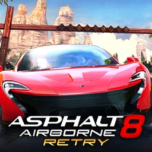

<div align="center">



# a8retry_nx

**Asphalt 8: Airborne Retry on Nintendo Switch**

An unofficial Nintendo Switch wrapper for the Android version of
**Asphalt 8: Airborne**, as modified by the **Asphalt 8: Airborne Retry** mod.

[](#)
[](#)
[](#)

</div>

---

## About

`a8retry_nx` is a native wrapper that runs the 32-bit (armeabi-v7a) Android
build of **Asphalt 8: Airborne** on Nintendo Switch. It loads the game's own
engine library and recreates the Android, JNI, OpenSL ES audio, input and
OpenGL ES services it expects under Horizon OS. The process runs in AArch32
mode, on libnx32 and a 32-bit build of Mesa.

This release targets the **Asphalt 8: Airborne Retry (A8R) December build**:
Asphalt 8: Airborne 1.6.0 (`com.gameloft.android.HEP.GloftA8HP`, version code
16000) with the A8R mod. It needs the mod's three zips:

* `A8R APK December.zip`
* `A8R DATA.zip`
* `A8R DATA December.zip`

No game code or data is included. The engine is put together on the first
launch from the pieces the mod hides in its APK, as the mod's PLAY button does
on Android.

The mod's start screen is redrawn natively, with all of its options: graphics,
Quick Race, the Retry camera and difficulty, the soundtrack, backups and its
seven languages. A fourth options page, **SWITCH**, has the port's own
settings: CPU clock, the graphics driver thread, handheld GPU clock, screen
resolution and the race control layout.

---

## Controls

Races use a Switch layout by default. **OPTIONS > SWITCH > Race controls**
switches to the game's own NVIDIA SHIELD layout.

| Input | Action |
| --- | --- |
| **Left Stick** | Steer |
| **D-Pad Left / Right** | Steer |
| **A** | Accelerate |
| **B** | Brake |
| **ZR / R** | Drift |
| **ZL / L / Y** | Nitro |
| **X** | Change camera |
| **D-Pad Up** | Respawn |
| **+** | Pause |
| **Touchscreen** | Touch input in handheld mode, as on a phone |

In menus the D-Pad or left stick moves, A confirms and B goes back.
**OPTIONS > SWITCH > Confirm with the bottom button** swaps A and B by position.

On the start screen:

| Input | Action |
| --- | --- |
| **D-Pad / Left Stick** | Move |
| **A** | Select. On a value row, A starts editing, left and right change the value, and A finishes. |
| **B** | Back |
| **L / R** or **Left / Right** | Change the options page |
| **Right Stick** | Scroll |
| **+** | Play |
| **-** (held at launch) | Show the start screen when it is set to be skipped |

---

## Build

### Requirements

* Docker
* The vita2hos AArch32 toolchain image
  (`ghcr.io/vita2hos/devcontainer/vita2hos:latest`): devkitARM, switch-tools
  and miniz
* [libnx32](https://github.com/aks796/libnx32) 4.12.0 or newer, the 32-bit
  libnx. `build.sh` mounts its `prefix/` from a libnx32 checkout next to this
  one (`../libnx32/prefix`, built with its `./build.sh`), or from the path in
  `DCR_LIBNX32`.
* [mesa32](https://github.com/aks796/mesa32), the 32-bit Mesa 20.1 and
  libdrm_nouveau for Switch
* The `devkitpro/devkita64` image for the launcher
* Python 3 with Pillow, only for `tools/`

Both have prebuilt releases, which work as well as building them. Copy
mesa32's `lib/` and `include/` into `portlibs32/`:

```bash
mkdir -p portlibs32
cp -R /path/to/mesa32/include /path/to/mesa32/lib portlibs32/
```

`NOTES.md` lists what both libraries fix for this port, and what is still open.

Compile the 32-bit game program, then the launcher that carries it:

```bash
./build.sh
launcher/build.sh
```

The output is `launcher/a8retry_nx.nro`. The build number is written into both
programs.

For a clean rebuild:

```bash
./build.sh clean
./build.sh
```

`tools/icon/make_icon.py` makes the launcher icon (`launcher/icon.jpg`) from
the game's APK and OBB.

---

## Running

Requires Atmosphère and the sphaira homebrew menu.

Download `a8retry_nx.nro` from the releases page. Put it and the three A8R
zips in this folder on the SD card:

```text
sd:/switch/a8retry_nx/
├── a8retry_nx.nro
├── A8R APK December.zip
├── A8R DATA.zip
└── A8R DATA December.zip
```

Copy the zips as they are, without extracting them. They are recognized by what
they hold, so renamed downloads work. Files extracted on a computer also work:
the APK, under any file name, and the `gameloft` folder.

1. In sphaira, open the Homebrew tab, choose **Asphalt 8: Airborne Retry**,
   and pick **Install Forwarder** from its options.
2. Launch the new **Asphalt 8: Airborne Retry** icon on the HOME menu.

The first launch installs the zips (about 2 GB, a minute or two) and deletes
them. It then installs the game program as an Atmosphère ExeFS override for
that icon (`atmosphere/contents/<title id>/exefs.nsp`) and restarts it. The
game's first start builds the engine from the APK.

Afterwards the folder looks like this:

```text
sd:/switch/a8retry_nx/
├── a8retry_nx.nro
├── A8R.apk
├── gameloft/games/GloftA8HP/
├── libasphalt8.so
├── config.ini
├── data/
├── external/
└── debug.log
```

Settings live in `config.ini`, and every setting is also on the start screen.
Saves are in `data/`. A `background.jpg` or `background.png` in the folder
replaces the start screen's background.

To update, replace `a8retry_nx.nro`. The game updates its override on the next
launch. Zips or an APK copied into the folder later are installed on the next
launch too.

**Coming from an older build** (`/switch/a8retry`, `A8Retry.nro`): put the new
NRO in `/switch/a8retry_nx`, install the forwarder again and delete the old
icon. The first start moves the game files, settings and saves from the old
folder and lists them in `migrated.txt`. Only the old NRO stays behind.

---

## Status

Races run at 60 fps on hardware, with the CPU at 1785 MHz (the default,
adjustable on the SWITCH page). Career races, the garage, car collections,
audio, controllers, the touchscreen and saves are working.

Online features are not available. The game runs as a device without a
network connection, so multiplayer, online events and store features do not
work.

The wrapper is built for the **A8R December build**. Other builds of the mod
and the stock Asphalt 8 APK have not been tested.

---

## Credits

**Asphalt 8: Airborne Retry Nintendo Switch port**: aks796

**Asphalt 8: Airborne Retry** mod: Techboy1997

**Asphalt 8: Airborne**: Gameloft

The loader derives from the open-source Android `.so` loader work by Andy
Nguyen (TheOfficialFloW) and fgsfds, ported to AArch32 with reference to
vita2hos. The host code is shared with this author's Disney Crossy Road and
Plants vs. Zombies TV Touch ports. It is MIT-licensed. See `LICENSE`.

Uses stb_image and stb_truetype (Sean Barrett, public domain or MIT) and
minimp3 (lieff, CC0).

Built with devkitPro, devkitARM, libnx32 (vita2hos) and a 32-bit build of Mesa.

---

## Contributing

Bug reports and tested improvements are welcome. Include your firmware and
Atmosphère versions, steps to reproduce, and `debug.log` from the game folder.
If the game closed by itself, include `crash.log` and the newest file in
`atmosphere/crash_reports` as well.

---

## Disclaimer

This is an unofficial fan project and is not affiliated with, sponsored by or
endorsed by Nintendo or Gameloft. Asphalt and Asphalt 8: Airborne are
trademarks of Gameloft. Asphalt 8: Airborne Retry is a fan mod by Techboy1997.

No game code or assets are included. You need your own copy of the A8R mod's
files.
